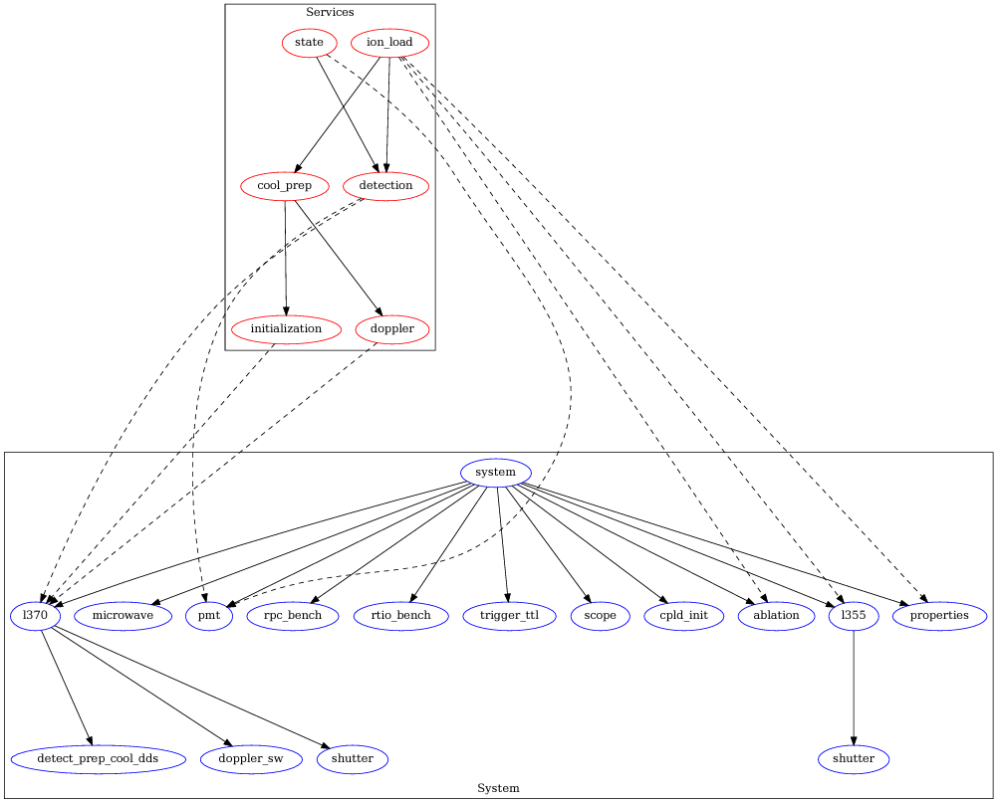

# ARTIQ DAX Tutorial for QCE24

## Setup

The setup consists of two 84HP 3U desktop crates, each hosting power supply and 
3 identical sets of modules that are later called "systems":

* Kasli v2.0.2
* DIO SMA v1.4.3 - channels 0-3 configured as outputs
* Urukul AD9910 v1.5.6
* Phaser Baseband (BB) v1.1.2

Therefore, the setup consists of 6 identical systems.

These systems are given consecutive letters from A to F. First crate hosts
systems from A to C, second from D to F.

Each system is connected to the individual oscilloscope that is available via
ARTIQ NDSP. Oscilloscopes are not identical, but have similar functionalites
(Tektronix 4000 Series). Every system is connected to the oscilloscope in 
the same way:

Oscilloscope ch. |     Module ch.
:---------------:|:-------------------------:
 1               |    DIO SMA ch. 0 (output)
 2               | Urukul AD9910 ch. 0
 3               | Urukul AD9910 ch. 1
 4               | Phaser BB RF out 0

## Network

Systems are available under the following addresses:

System |        IP        |          Host
:-----:|:----------------:|:----------------------:
   A   | `192.168.95.213` | `qce24sa.ise.pw.edu.pl`
   B   | `192.168.95.214` | `qce24sb.ise.pw.edu.pl`
   C   | `192.168.95.215` | `qce24sc.ise.pw.edu.pl`
   D   | `192.168.95.216` | `qce24sd.ise.pw.edu.pl`
   E   | `192.168.95.217` | `qce24se.ise.pw.edu.pl`
   F   | `192.168.95.218` | `qce24sf.ise.pw.edu.pl`

## Oscilloscopes

Systems are connected to 6 individual oscilloscopes:

System |     Osc. model      |   Osc. address
:-----:|:-------------------:|:---------------:
   A   |  Tektronix MSO4104  | `192.168.95.182`
   B   | Tektronix MDO4104-3 | `192.168.95.142`
   C   |  Tektronix MSO4104  | `192.168.95.164`
   D   |  Tektronix DPO4104  | `192.168.95.181`
   E   |  Tektronix MSO4104  | `192.168.95.165`
   F   |   To be selected    |       `-`

## Current status

System |                     Status                      | Tested
:-----:|:-----------------------------------------------:|:-----:
   A   |         Flashed, signals not connected          |   OK
   B   |               Flashed, connected                |   OK
   C   |               Flashed, connected                |   OK
   D   |         Flashed, signals not connected          |   No
   E   |         Flashed, signals not connected          |   No
   F   | Flashed, signals not connected, no oscilloscope |   No

## Deployment

`deploy` command performs deployment of user experiment directories 
to the given directory `--target-dir`.

In target directory 6 subdirectories are created, corresponding to
6 different masters. They are called `system_a` for setup A etc.

Each of `system_<a..f>` directories consists of one subdirectory
holding experiment files called `repository` and `device_db.py` 
file corresponding to a given setup.

`repository` subdirectory consists of number of subdirectories
for user experiments named by the pattern `user_<n>`. The number
of such subdirectories depends on `--users` parameter.

Each `system_<m>/repository/user_<n>` directory consists of experiment 
files copied from `experiments/repository` and `user.py` file defining
`user_id` Python variable

# DAX

## Modules and Services

The following plot shows the connection between modules and services used in this demo system


Hardware is assigned as follows:

| Device | Channel | Use | Module | 
| --- | --- | --- | --- |
| TTL Out | 0 | Scope Trigger | TriggerTTL |
| TTL Out | 1 | Ablation Trigger | Ablation |
| TTL Out | 2 | Cooling Sideband | Laser370 |
| TTL Out | 3 | RTIO Benchmark | RTIOBenchmarkModule |
| TTL In | 4 | PMT 1 | PMT |
| TTL In | 5 | PMT 2 | PMT |
| TTL In | 6 | PMT 3 | PMT |
| TTL In | 7 | RTIO Benchmark | RTIOBenchmarkModule |
| AD9910 | 0 | Microwave | Microwav |
| AD9910 | 1 | 370 Modulation | Laser370 |
| AD9910 | 2 | 370 Shutter | Laser370 |
| AD9910 | 3 | 355 Shutter | Laser355 |

Before running the `artiq_session` or `artiq_run`, run the following command from the `experiments` directory of this repository:
```
artiq_run --device-db device_db_sim.py dax_setup.py -c DaxSetup -q
```

To run the `artiq_session` in sim mode, run the following command from the `experiments` directory
```
artiq_session -m=--device-db -m device_db_sim.py
```

To run unittest, run the following command at the root of this repository:
```
pytest
```
